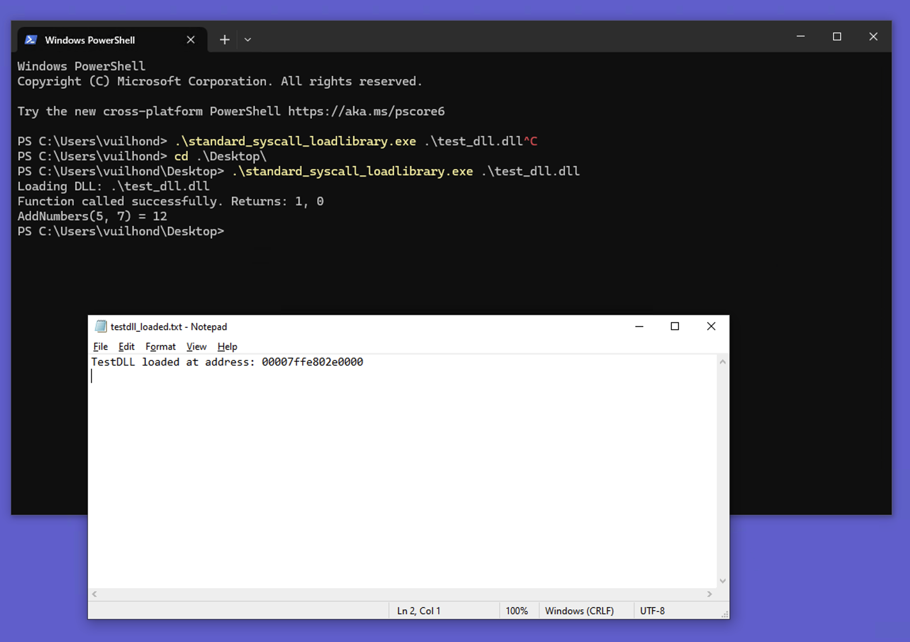
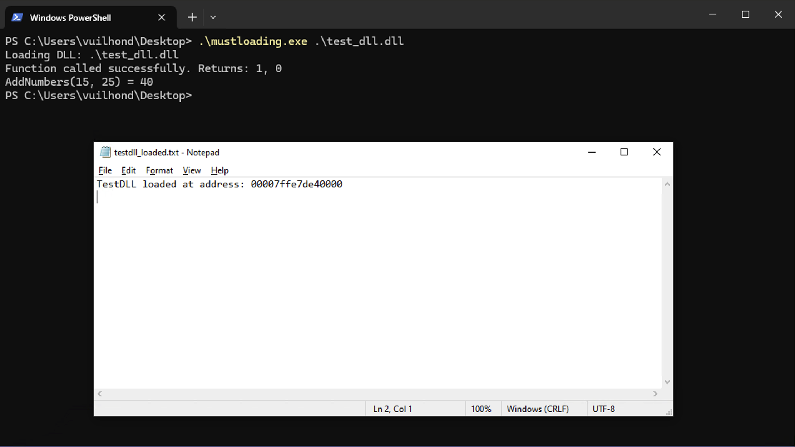
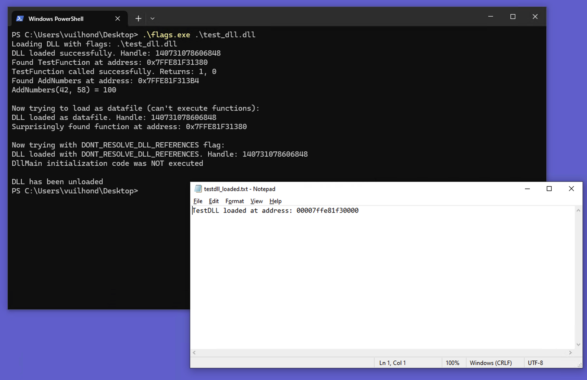

## test_dll_generator
Simple dll (`testdll.cpp`) to test loading techniques, does 3 things:
- Show a GUI pop-up message when `TestFunction` is called.
- Return the sum of two numbers when `AddNumbers` is called.
- Write to a log file (`C:\Windows\Temp\testdll_loaded.txt`) containing ref to DLL memory address when the DLL is loaded.

To compile on mac for win
```shell
x86_64-w64-mingw32-g++ testdll.cpp -o testdll.dll -shared -static-libgcc -static-libstdc++ -luser32
```


## standard_syscall_loadlibrary

1. **Loading the DLL** - `syscall.LoadLibrary()` loads DLL code into our process's memory space. 

2. **Finding function addresses** - `syscall.GetProcAddress()` locates specific functions inside the loaded DLL by name, giving us a memory address (pointer) that we can then call.

3. **Calling functions** - `syscall.Syscall()` executes the function at the address located in #2. It also marshals Go values into the format the C/C++ function expects, and converts return values back to Go.

This is the most direct method using `syscall` library, maps closely to the Windows API.



## lazyloading

1. **Creating a Reference** - `syscall.NewLazyDLL()` doesn't actually load the DLL immediately, but instead creates a reference that will be resolved later. This is a key difference - no LoadLibrary call happens at this point.

2. **Defining Function References** - `dll.NewProc()` similarly doesn't look up function addresses right away, but creates placeholder references to functions that will be resolved when needed.

3. **Deferred Actual Loading** - The first call to `proc.Call()` triggers the actual loading process behind the scenes. Only at this point does the system perform the LoadLibrary operation and function address resolution.

- The most significant difference is timing - lazy loading defers all the actual DLL loading operations until the first function call, making the loading process invisible until functionality is actually used.
- This creates a smaller initial footprint and delays telltale API calls that might trigger security monitoring systems.
- Unlike standard loading, no explicit FreeLibrary call is needed since the Go runtime manages the lifecycle of the lazily loaded DLL, which gets unloaded when the program terminates.


## mustloading

1. **Immediate Forceful Loading** - `syscall.MustLoadDLL()` loads the DLL immediately into the process memory and panics if loading fails for any reason. 

2. **Non-Negotiable Function Resolution** - `dll.MustFindProc()` likewise demands that the function exists in the DLL, panicking if it can't be found rather than returning an error, ensuring all expected functionality is available.

3. **Function Calling** - `proc.Call()` works the same way as in other methods, executing the function with the provided parameters and returning results and error information.

4. **Explicit Cleanup Required** - `defer dll.Release()` must be called to properly unload the DLL when finished, similar to standard loading but unlike lazy loading.

- The defining characteristic of must loading is its uncompromising approach—it either works completely or fails immediately with a panic, making no attempt to handle missing dependencies gracefully. 
- This creates a binary success/failure outcome that leaves little room for stealth when things go wrong.




## flags_w_loadlibraryex

Using 3 different `LoadLibraryEx` flags to load DLLs in different ways:
1. Standard execution mode, 
- Functionally equivalent to using `LoadLibrary`.
- But operating directly on the memory addresses rather than through a library abstraction.

2. As a datafile with `LOAD_LIBRARY_AS_DATAFILE`,  
- Maps the DLL as a data file, not as an executable. 
- The system doesn't prepare the DLL for execution - it's just a block of read-only memory.

3. With delayed dependency resolution (`DONT_RESOLVE_DLL_REFERENCES`).
- Prevents the loader from loading dependent DLLs and calling DllMain. 
- Creates a "shallow" load where the DLL itself is mapped but not fully initialized.
- Useful when you want to inspect a DLL's exports without triggering its initialization code.


✅ Standard loading executed as is expected

⚠️ The code expected to NOT be able to find the function address when loading with LOAD_LIBRARY_AS_DATAFILE, but it actually could
- LOAD_LIBRARY_AS_DATAFILE doesn't prevent access to the export table (the list of functions)
- You can still find function addresses with GetProcAddress
- However, trying to actually call those functions would likely fail (your code didn't attempt this)

✅ DONT_RESOLVE_DLL_REFERENCES -> confirms the flag correctly prevented the DLL's initialization code from running.


